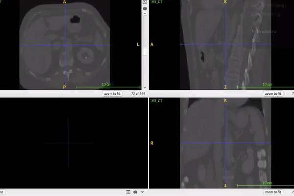
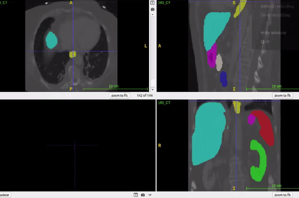

# Vraj Patel
 

# Biography
Currently pursuing Computer Engineer(B.Tech) from Nirma University, Ahmedabad, India. Worked across diverse domains like Medical Imaging, Satellite Imagery, Generative and Adversial Networks, Computer Vision, Image Processing, in the field of Artificial Intelligence, Machine Learning, and Deep Learning since April,2018.

# Education
- Bachelor's - Nirma University, Ahmedabad 
- High School - Shree Narayan Vidhyalaya,Vadodara
- Primary and Secondary School - Ambe Vidhyalaya,Vadodara

# Skills
- Programming Languages: C, C++, PHP, JAVA, MySQL(XAMPP)
- Frameworks: Tensorflow, Keras, Scikit-learn 
- Tools: Anaconda, MatLab, Jupyter Notebook, Eclipse, Xampp, Spyder
- System: Windows(98/vista/7/8/8.1/10), Linux, Ubuntu

# Research
Currently, I am involved in a research project of Medical Image Segmentation and NLP with the help of Deep Learning.

#### 3D Brain Tumor Segmentation of MR Images 
- Segmentation of brain tumor from MRI considering 3D volume.
- The dataset used in the project is BraTS(2018-19) which contains 3D images of glioma brain tumor.

#### Denoising Autoencoder using GAN
- Denoising of noisy MNIST dataset and 2-D Brain image dataset containing different types and variations of noises.
- Model used was Stacked Sparse Denoising Autoencoder.
- GAN was used for further improve the quality of images.

#### Object Identification
- Implemented YOLO v2/v3 on detecting a custom objects.
- Also worked on Retinanet (RESNET50) on the same.
- Currently trying the same on Satellite images.
#### Multi-organ Segmentation
- Performed multi-organ segmentation on 8 organs of the human body.
- The organs included the pancreas, three organs fronm gastrointestinal tract (esophagus, stomach and duodenum), liver, gallbladder, spleen and left kidney.

 
 

#### Type-2 Diabetes
- Worked on triopathy of diabetes i.e. Nephropathy, Neuropathy and Retinopathy.  
- This project was in collaboration with Diacare Diabetes center. The data contained real city patients with 373+ attributes of all complications of Diabetes. 
- The model will work like an assistant to the doctor which would help in diagnosis of Nephropathy mainly.

# Other Projects

#### Basic Personal Assistant without AI
- A system which assist a person according to his/her schedule.
- Worked with HTML and MySQL database.

#### Qr code and Fund Transfer
- Worked with java and created a code for generating QR Code and reading a QR code
- Also Xampp database which was connected with java and perform transection operation on database. 

# Certifications and Courses
- Image Processing and Pattern Recognition, NPTEL
- Python, IIT Bombay
- Deep Learning Specialization, Prof. Andrew Ng.
- Machine Learning by Stanford University, Prof. Andrew Ng.

# Hobbies & Interests
- Listening Songs.
- Plauing Sports.
- Watching TV series.
- Surfing the internet.

  
  
  

